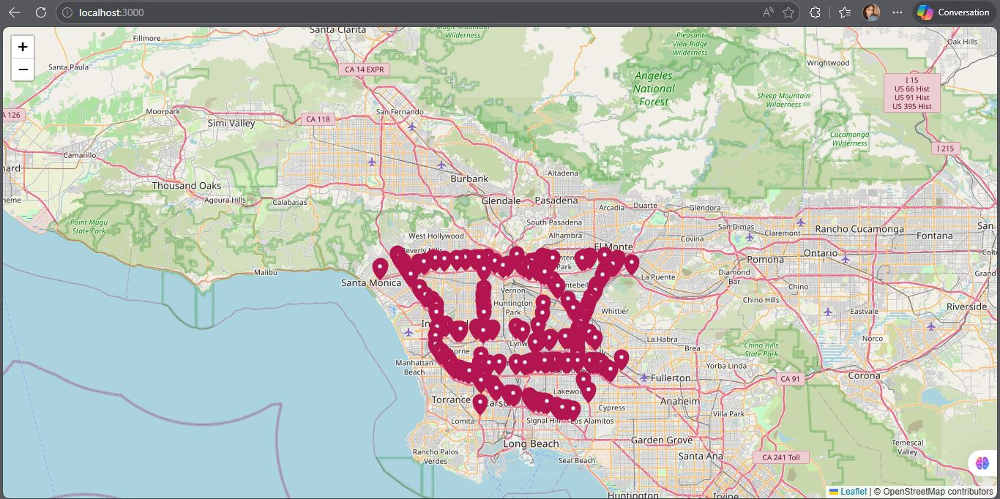
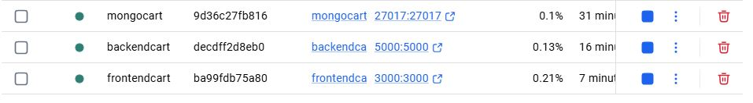

# Map (Sensors) — Full‑stack demo

This repository contains:
- **Frontend**: React + Vite + Leaflet(bib js pour affichage des cartes) (`frontend/`) served on **:3000**
- **Backend**: Node.js + Express + MongoDB (`backend/`) served on **:5000**
- **MongoDB**: initialization script + indexes (`mongo/`)
- **Dataset**: station metadata CSV (`backend/data/PeMSD7_M_Station_Info.csv`)


## Screen Shots from the project





## Project structure

- `frontend/`: Vite app (React, Leaflet)
- `backend/`: Express API that loads the CSV into MongoDB and serves:
  - `GET /api/stations`
  - `GET /api/links`
  - `GET /api/health`
  - `data/`: CSV file imported by the backend at startup
- `mongo/`: Mongo image + `init.js` creating DB/indexes

## Prerequisites

- **Node.js 20+** and npm (for local dev), or **Docker** (for containers)

## Local development (no Docker)
### 1) Créer le réseau Docker

PowerShell:

```bash
docker network create cartNetwork
```

### 2) Start MongoDB (recommended: Docker volume, no local install)

Même si tu n’as pas Mongo installé localement, tu peux utiliser Docker : 

PowerShell:

```bash
docker run -d \
  --name mongocart \
  --network cartNetwork \
  -p 27017:27017 \
  -v "${PWD}/mongo/init.js:/docker-entrypoint-initdb.d/init.js:ro" \
  mongo:7
```

### 3) Start the backend

```bash
docker build -t backendcart -f backend/Dockerfile .
docker run -d \
  --name backendcart \
  --network cartNetwork \
  -p 5000:5000 \
  -e MONGO_URI="mongodb://mongocart:27017" \
  backendcart
```

Notes:
- Backend listens on `http://localhost:5000`
- Backend imports `data/PeMSD7_M_Station_Info.csv` into DB `sensorsdb` at startup.

### 4) Start the frontend

```bash
docker build -t frontendcart ./frontend
docker run -d \
  --name frontendcart \
  --network cartNetwork \
  -p 3000:3000 \
  -e REACT_APP_BACKEND_URL="http://backendcart:5000" \
  frontendcart
```
Frontend listens on `http://localhost:3000`.
